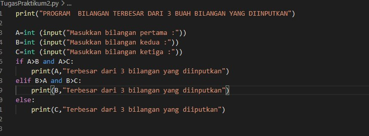
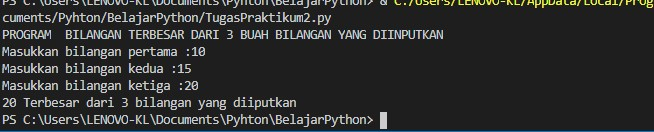

# labspy02

Nama : Andriansyah

Nim : 312010011

Kelas : TI.20.B1

# Algoritma Praktikum 2

- Bentuk contoh flowchart

- Lakukan kodingan seperti ini :

- jika sudah run 
- maka hasilya akan seperti ini :

